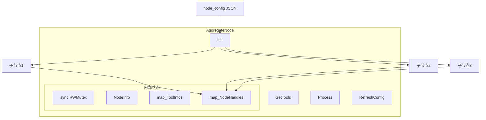
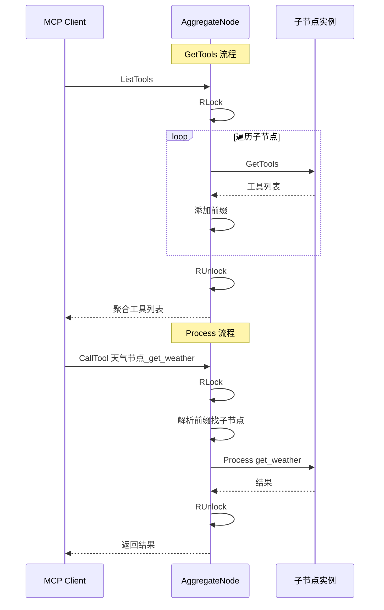

# Y26 统一 Combine API 接口 - 实施计划

## 一、方案评估结论

**结论：✅ 方案可落地，与现有架构完全适配**

### 现有架构支持情况

| 方案要求 | 现有支持 | 说明 |
|---------|---------|------|
| Processor 接口 | ✅ 已有 | 直接实现 Init/GetTools/Process/GetNodeInfo |
| node_config JSONB | ✅ 已有 | 无需改表结构 |
| NodeRegistry 注册 | ✅ 已有 | 添加 aggregate_handle 即可 |
| 读写锁 | ✅ Go 原生 | sync.RWMutex |
| 子节点实例化 | ✅ 已有 | 复用 CreateNodeByType |
| 热更新接口 | ⚠️ 需新增 | 新增 reload API |

---

## 二、架构设计



### 数据流



---

## 三、实施步骤

### 阶段 1：新增 AggregateNode 核心实现

**文件**: `src/servers/task_nodes/aggregate_node.go`

```go
// 核心结构
type AggregateNode struct {
    mutex           sync.RWMutex
    NodeInfo        *types.NodeInfo
    mapToolInfos    map[string]*AggregatedTool  // 工具名 -> 工具信息
    mapNodeHandles  map[string]types.Processor  // 节点名 -> 节点实例
    subNodeNames    []string                     // 配置的子节点名称列表
}

type AggregatedTool struct {
    OriginalName string           // 原始工具名
    NodeName     string           // 所属节点名
    ToolDesc     *types.ToolDesc  // 工具描述
}
```

**实现方法**:
- `Init()` - 解析 node_config，初始化子节点
- `GetTools()` - 聚合子节点工具，添加前缀
- `Process()` - 路由请求到对应子节点
- `GetNodeInfo()` - 返回节点信息
- `RefreshConfig()` - 热更新配置

### 阶段 2：新增配置解析

**文件**: `src/servers/task_nodes/node_config.go`

新增函数:
```go
// ParseAggregateConfig 解析聚合节点配置
func ParseAggregateConfig(raw string) ([]string, error)
```

配置格式:
```json
["天气节点", "搜索节点"]
```

### 阶段 3：注册到 NodeRegistry

**文件**: `src/servers/task_nodes/base_node.go`

```go
var NodeRegistry = map[string]func() types.Processor{
    // ... 现有节点
    "aggregate_handle": func() types.Processor {
        return &AggregateNode{}
    },
}
```

### 阶段 4：新增热更新 API

**新增路由**: `POST /api/mcp-server/reload/{server_id}`

**逻辑**:
1. 根据 server_id 找到对应 Server
2. 遍历 ChainInstance 中的节点
3. 如果是 AggregateNode，调用 RefreshConfig()
4. 重新构建工具列表

---

## 四、关键实现细节

### 4.1 工具名前缀规则

```
聚合后工具名 = 节点名称(去空格) + "_" + 原工具名
```

| 节点名称 | 原工具名 | 聚合后工具名 |
|---------|---------|-------------|
| 天气节点 | get_weather | 天气节点_get_weather |
| 搜索节点 | search | 搜索节点_search |

### 4.2 并发控制

| 操作 | 锁类型 | 说明 |
|-----|-------|------|
| GetTools | RLock | 多请求可并发读 |
| Process | RLock | 多请求可并发处理 |
| RefreshConfig | Lock | 写时阻塞所有读 |

### 4.3 子节点查找逻辑

Init 时需要根据节点名称查询数据库获取节点信息:

```go
// 根据节点名称查询
func (m *AeMcpTaskNode) GetByNodeName(nodeName string) (*AeMcpTaskNode, error)
```

---

## 五、测试方案

### 5.1 数据准备

1. 创建子节点记录（天气节点、搜索节点）
2. 创建聚合节点记录:
   - node_handle: `aggregate_handle`
   - node_config: `["天气节点", "搜索节点"]`

### 5.2 测试用例

| 步骤 | 操作 | 预期结果 |
|-----|------|---------|
| 1 | MCP Inspector 连接聚合服务 | 工具列表显示 天气节点_xxx、搜索节点_xxx |
| 2 | 调用 天气节点_get_weather | 返回天气数据 |
| 3 | 修改 node_config 去掉搜索节点 | - |
| 4 | 调用 reload 接口 | 返回成功 |
| 5 | 刷新 Inspector | 工具列表只剩 天气节点_xxx |

---

## 六、文件变更清单

| 文件 | 操作 | 说明 |
|-----|------|------|
| `src/servers/task_nodes/aggregate_node.go` | 新增 | AggregateNode 核心实现 |
| `src/servers/task_nodes/node_config.go` | 修改 | 新增 ParseAggregateConfig |
| `src/servers/task_nodes/base_node.go` | 修改 | 注册 aggregate_handle |
| `src/models/ae_mcp_task_node.go` | 修改 | 新增 GetByNodeName 方法 |
| `src/servers/server.go` | 修改 | 新增 reload 相关逻辑 |
| `src/main.go` 或路由文件 | 修改 | 新增 reload API 路由 |

---

## 七、风险与注意事项

1. **循环依赖**: 聚合节点的子节点不能再是聚合节点，需要在 Init 时校验
2. **节点名称唯一性**: 子节点名称必须在数据库中唯一
3. **热更新期间的请求**: 写锁期间会阻塞所有读请求，需要控制更新频率
4. **子节点初始化失败**: 单个子节点失败不应影响其他子节点，需要容错处理
